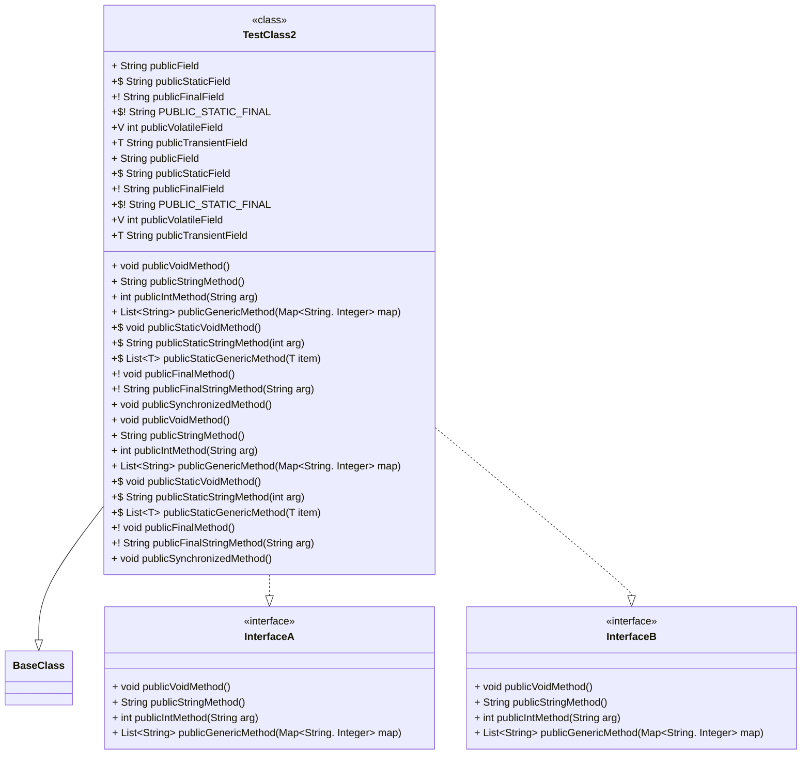

# Mermaid Diagram Creator CLI

My mermaid diagrams tool is a CLI that allows for creating diagrams.

## Installation

See Releases

## How To

To use the cli follow the command below and it will create markdown files with class diagrams for each java file found in the root path (-r) defined.

Right now only java is implemented, future releases will have multiple languages (-l) and diagrams.

<pre>memdia -r ./path/to/my/java/project -l java</pre>

## Class Diagrams

Example diagrams will look like this.

