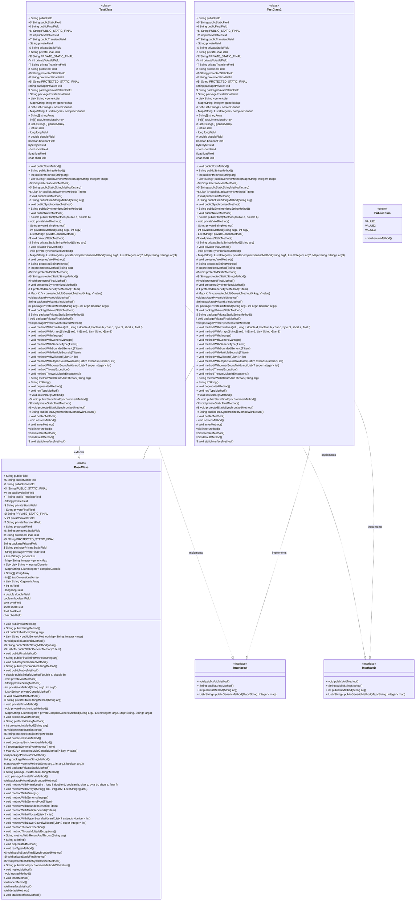

```mermaid
classDiagram
	TestClass --|> BaseClass : extends
	TestClass ..|> InterfaceA : implements
	TestClass ..|> InterfaceB : implements
	class TestClass {
		<<class>>
		+ String publicField
		+$ String publicStaticField
		+! String publicFinalField
		+$! String PUBLIC_STATIC_FINAL
		+V int publicVolatileField
		+T String publicTransientField
		- String privateField
		-$ String privateStaticField
		-! String privateFinalField
		-$! String PRIVATE_STATIC_FINAL
		-V int privateVolatileField
		-T String privateTransientField
		# String protectedField
		#$ String protectedStaticField
		#! String protectedFinalField
		#$! String PROTECTED_STATIC_FINAL
		 String packagePrivateField
		$ String packagePrivateStaticField
		! String packagePrivateFinalField
		+ List~String~ genericList
		- Map~String. Integer~ genericMap
		# Set~List~String~~ nestedGeneric
		- Map~String. List~Integer~~ complexGeneric
		+ String[] stringArray
		- int[][] twoDimensionalArray
		# List~String~[] genericArray
		+ int intField
		- long longField
		# double doubleField
		 boolean booleanField
		 byte byteField
		 short shortField
		 float floatField
		 char charField
		+ void publicVoidMethod()
		+ String publicStringMethod()
		+ int publicIntMethod(String arg)
		+ List~String~ publicGenericMethod(Map~String. Integer~ map)
		+$ void publicStaticVoidMethod()
		+$ String publicStaticStringMethod(int arg)
		+$ List~T~ publicStaticGenericMethod(T item)
		+! void publicFinalMethod()
		+! String publicFinalStringMethod(String arg)
		+ void publicSynchronizedMethod()
		+ String publicSynchronizedStringMethod()
		+ void publicNativeMethod()
		+ double publicStrictfpMethod(double a, double b)
		- void privateVoidMethod()
		- String privateStringMethod()
		- int privateIntMethod(String arg1, int arg2)
		- List~String~ privateGenericMethod()
		-$ void privateStaticMethod()
		-$ String privateStaticStringMethod(String arg)
		-! void privateFinalMethod()
		- void privateSynchronizedMethod()
		- Map~String. List~Integer~~ privateComplexGenericMethod(String arg1, List~Integer~ arg2, Map~String. String~ arg3)
		# void protectedVoidMethod()
		# String protectedStringMethod()
		# int protectedIntMethod(String arg)
		#$ void protectedStaticMethod()
		#$ String protectedStaticStringMethod()
		#! void protectedFinalMethod()
		# void protectedSynchronizedMethod()
		# T protectedGenericTypeMethod(T item)
		# Map~K. V~ protectedMultiGenericMethod(K key, V value)
		 void packagePrivateVoidMethod()
		 String packagePrivateStringMethod()
		 int packagePrivateIntMethod(String arg1, int arg2, boolean arg3)
		$ void packagePrivateStaticMethod()
		$ String packagePrivateStaticStringMethod()
		! void packagePrivateFinalMethod()
		 void packagePrivateSynchronizedMethod()
		+ void methodWithPrimitives(int i, long l, double d, boolean b, char c, byte bt, short s, float f)
		+ void methodWithArrays(String[] arr1, int[] arr2, List~String~[] arr3)
		+ void methodWithVarargs()
		+ void methodWithGenericVarargs()
		+ void methodWithGenericType(T item)
		+ void methodWithBoundedGeneric(T item)
		+ void methodWithMultipleBounds(T item)
		+ void methodWithWildcard(List~?~ list)
		+ void methodWithUpperBoundWildcard(List~? extends Number~ list)
		+ void methodWithLowerBoundWildcard(List~? super Integer~ list)
		+ void methodThrowsException()
		+ void methodThrowsMultipleExceptions()
		+ String methodWithReturnAndThrows(String arg)
		+ String toString()
		+ void deprecatedMethod()
		+ void rawTypeMethod()
		+! void safeVarargsMethod()
		+$! void publicStaticFinalSynchronizedMethod()
		-$! void privateStaticFinalMethod()
		#$ void protectedStaticSynchronizedMethod()
		+! String publicFinalSynchronizedMethodWithReturn()
		+ void nestedMethod()
		- void nestedMethod()
		# void innerMethod()
		 void innerMethod()
		 void interfaceMethod()
		 void defaultMethod()
		$ void staticInterfaceMethod()
	}

	TestClass2 --|> BaseClass : extends
	TestClass2 ..|> InterfaceA : implements
	TestClass2 ..|> InterfaceB : implements
	class TestClass2 {
		<<class>>
		+ String publicField
		+$ String publicStaticField
		+! String publicFinalField
		+$! String PUBLIC_STATIC_FINAL
		+V int publicVolatileField
		+T String publicTransientField
		- String privateField
		-$ String privateStaticField
		-! String privateFinalField
		-$! String PRIVATE_STATIC_FINAL
		-V int privateVolatileField
		-T String privateTransientField
		# String protectedField
		#$ String protectedStaticField
		#! String protectedFinalField
		#$! String PROTECTED_STATIC_FINAL
		 String packagePrivateField
		$ String packagePrivateStaticField
		! String packagePrivateFinalField
		+ List~String~ genericList
		- Map~String. Integer~ genericMap
		# Set~List~String~~ nestedGeneric
		- Map~String. List~Integer~~ complexGeneric
		+ String[] stringArray
		- int[][] twoDimensionalArray
		# List~String~[] genericArray
		+ int intField
		- long longField
		# double doubleField
		 boolean booleanField
		 byte byteField
		 short shortField
		 float floatField
		 char charField
		+ void publicVoidMethod()
		+ String publicStringMethod()
		+ int publicIntMethod(String arg)
		+ List~String~ publicGenericMethod(Map~String. Integer~ map)
		+$ void publicStaticVoidMethod()
		+$ String publicStaticStringMethod(int arg)
		+$ List~T~ publicStaticGenericMethod(T item)
		+! void publicFinalMethod()
		+! String publicFinalStringMethod(String arg)
		+ void publicSynchronizedMethod()
		+ String publicSynchronizedStringMethod()
		+ void publicNativeMethod()
		+ double publicStrictfpMethod(double a, double b)
		- void privateVoidMethod()
		- String privateStringMethod()
		- int privateIntMethod(String arg1, int arg2)
		- List~String~ privateGenericMethod()
		-$ void privateStaticMethod()
		-$ String privateStaticStringMethod(String arg)
		-! void privateFinalMethod()
		- void privateSynchronizedMethod()
		- Map~String. List~Integer~~ privateComplexGenericMethod(String arg1, List~Integer~ arg2, Map~String. String~ arg3)
		# void protectedVoidMethod()
		# String protectedStringMethod()
		# int protectedIntMethod(String arg)
		#$ void protectedStaticMethod()
		#$ String protectedStaticStringMethod()
		#! void protectedFinalMethod()
		# void protectedSynchronizedMethod()
		# T protectedGenericTypeMethod(T item)
		# Map~K. V~ protectedMultiGenericMethod(K key, V value)
		 void packagePrivateVoidMethod()
		 String packagePrivateStringMethod()
		 int packagePrivateIntMethod(String arg1, int arg2, boolean arg3)
		$ void packagePrivateStaticMethod()
		$ String packagePrivateStaticStringMethod()
		! void packagePrivateFinalMethod()
		 void packagePrivateSynchronizedMethod()
		+ void methodWithPrimitives(int i, long l, double d, boolean b, char c, byte bt, short s, float f)
		+ void methodWithArrays(String[] arr1, int[] arr2, List~String~[] arr3)
		+ void methodWithVarargs()
		+ void methodWithGenericVarargs()
		+ void methodWithGenericType(T item)
		+ void methodWithBoundedGeneric(T item)
		+ void methodWithMultipleBounds(T item)
		+ void methodWithWildcard(List~?~ list)
		+ void methodWithUpperBoundWildcard(List~? extends Number~ list)
		+ void methodWithLowerBoundWildcard(List~? super Integer~ list)
		+ void methodThrowsException()
		+ void methodThrowsMultipleExceptions()
		+ String methodWithReturnAndThrows(String arg)
		+ String toString()
		+ void deprecatedMethod()
		+ void rawTypeMethod()
		+! void safeVarargsMethod()
		+$! void publicStaticFinalSynchronizedMethod()
		-$! void privateStaticFinalMethod()
		#$ void protectedStaticSynchronizedMethod()
		+! String publicFinalSynchronizedMethodWithReturn()
		+ void nestedMethod()
		- void nestedMethod()
		# void innerMethod()
		 void innerMethod()
		 void interfaceMethod()
		 void defaultMethod()
		$ void staticInterfaceMethod()
	}

	class BaseClass {
		<<class>>
		+ String publicField
		+$ String publicStaticField
		+! String publicFinalField
		+$! String PUBLIC_STATIC_FINAL
		+V int publicVolatileField
		+T String publicTransientField
		- String privateField
		-$ String privateStaticField
		-! String privateFinalField
		-$! String PRIVATE_STATIC_FINAL
		-V int privateVolatileField
		-T String privateTransientField
		# String protectedField
		#$ String protectedStaticField
		#! String protectedFinalField
		#$! String PROTECTED_STATIC_FINAL
		 String packagePrivateField
		$ String packagePrivateStaticField
		! String packagePrivateFinalField
		+ List~String~ genericList
		- Map~String. Integer~ genericMap
		# Set~List~String~~ nestedGeneric
		- Map~String. List~Integer~~ complexGeneric
		+ String[] stringArray
		- int[][] twoDimensionalArray
		# List~String~[] genericArray
		+ int intField
		- long longField
		# double doubleField
		 boolean booleanField
		 byte byteField
		 short shortField
		 float floatField
		 char charField
		+ void publicVoidMethod()
		+ String publicStringMethod()
		+ int publicIntMethod(String arg)
		+ List~String~ publicGenericMethod(Map~String. Integer~ map)
		+$ void publicStaticVoidMethod()
		+$ String publicStaticStringMethod(int arg)
		+$ List~T~ publicStaticGenericMethod(T item)
		+ void publicFinalMethod()
		+ String publicFinalStringMethod(String arg)
		+ void publicSynchronizedMethod()
		+ String publicSynchronizedStringMethod()
		+ void publicNativeMethod()
		+ double publicStrictfpMethod(double a, double b)
		- void privateVoidMethod()
		- String privateStringMethod()
		- int privateIntMethod(String arg1, int arg2)
		- List~String~ privateGenericMethod()
		-$ void privateStaticMethod()
		-$ String privateStaticStringMethod(String arg)
		-! void privateFinalMethod()
		- void privateSynchronizedMethod()
		- Map~String. List~Integer~~ privateComplexGenericMethod(String arg1, List~Integer~ arg2, Map~String. String~ arg3)
		# void protectedVoidMethod()
		# String protectedStringMethod()
		# int protectedIntMethod(String arg)
		#$ void protectedStaticMethod()
		#$ String protectedStaticStringMethod()
		# void protectedFinalMethod()
		# void protectedSynchronizedMethod()
		# T protectedGenericTypeMethod(T item)
		# Map~K. V~ protectedMultiGenericMethod(K key, V value)
		 void packagePrivateVoidMethod()
		 String packagePrivateStringMethod()
		 int packagePrivateIntMethod(String arg1, int arg2, boolean arg3)
		$ void packagePrivateStaticMethod()
		$ String packagePrivateStaticStringMethod()
		! void packagePrivateFinalMethod()
		 void packagePrivateSynchronizedMethod()
		+ void methodWithPrimitives(int i, long l, double d, boolean b, char c, byte bt, short s, float f)
		+ void methodWithArrays(String[] arr1, int[] arr2, List~String~[] arr3)
		+ void methodWithVarargs()
		+ void methodWithGenericVarargs()
		+ void methodWithGenericType(T item)
		+ void methodWithBoundedGeneric(T item)
		+ void methodWithMultipleBounds(T item)
		+ void methodWithWildcard(List~?~ list)
		+ void methodWithUpperBoundWildcard(List~? extends Number~ list)
		+ void methodWithLowerBoundWildcard(List~? super Integer~ list)
		+ void methodThrowsException()
		+ void methodThrowsMultipleExceptions()
		+ String methodWithReturnAndThrows(String arg)
		+ String toString()
		+ void deprecatedMethod()
		+ void rawTypeMethod()
		+$ void publicStaticFinalSynchronizedMethod()
		-$! void privateStaticFinalMethod()
		#$ void protectedStaticSynchronizedMethod()
		+ String publicFinalSynchronizedMethodWithReturn()
		+ void nestedMethod()
		- void nestedMethod()
		# void innerMethod()
		 void innerMethod()
		 void interfaceMethod()
		 void defaultMethod()
		$ void staticInterfaceMethod()
	}

	class PublicEnum {
		<<enum>>
		  VALUE1
		  VALUE2
		  VALUE3
		+ void enumMethod()
	}

	class InterfaceA {
		<<interface>>
		+ void publicVoidMethod()
		+ String publicStringMethod()
		+ int publicIntMethod(String arg)
		+ List~String~ publicGenericMethod(Map~String. Integer~ map)
	}

	class InterfaceB {
		<<interface>>
		+ void publicVoidMethod()
		+ String publicStringMethod()
		+ int publicIntMethod(String arg)
		+ List~String~ publicGenericMethod(Map~String. Integer~ map)
	}

```